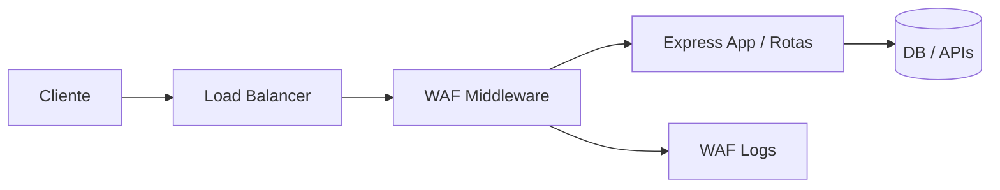

# WAF Express — Firewall de Aplicação Web (Customizado)

Projeto demonstrativo de um WAF (Web Application Firewall) customizado implementado como middleware para Express (Node.js).

## Instalação
```bash
git clone <seu-repo>
cd waf-express
npm install
cp .env.example .env
npm run dev
```

# Documentação — WAF Express

## Arquitetura

