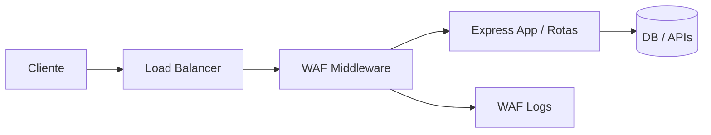

# WAF Express — Firewall de Aplicação Web (Customizado)

Projeto demonstrativo de um WAF (Web Application Firewall) customizado implementado como middleware para Express (Node.js).

# Estrutura do projeto
```
waf-express/
├── .env.example
├── .gitignore
├── Dockerfile
├── docker-compose.yml
├── package.json
├── src/
│ ├── index.js
│ ├── config.js 
│ ├── routes/
│ │ ├── index.js
│ │ └── protected.js
│ ├── middleware/
│ │ ├── waf.js 
│ │ └── rateLimiter.js 
│ └── utils/
│ └── logger.js
├── tests/
│ └── waf.test.js
└── .vscode/
├── launch.json
└── tasks.json
```

## Instalação
```bash
git clone <seu-repo>
cd waf-express
npm install
cp .env.example .env
npm run dev
```

# Documentação — WAF Express

## Arquitetura

